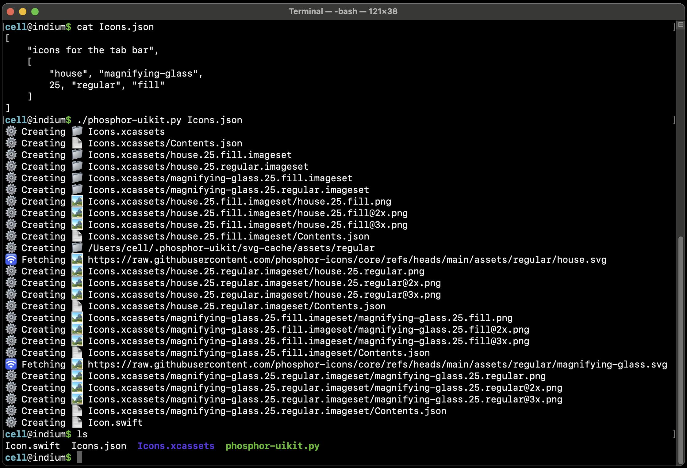

# Xcode asset catalog generator for Swift/UIKit

If you haven't yet migrated to SwiftUI, you may prefer to stick with PNG's (rather than SVG's) for your Xcode [asset catalogs](https://developer.apple.com/documentation/xcode/managing-assets-with-asset-catalogs).

`phosphor-uikit.py` is a script which uses [Phosphor icons](https://phosphoricons.com/) to generate PNG-based asset catalogs for Xcode based on JSON configuration files.


## Demo



The above will generate `Icon.swift`:

```swift
// Generated by phosphor-uikit.py.  Edits will be clobbered by the next run.

import UIKit

/// Phosphor icons.
enum Icon: String, Equatable, Hashable, CaseIterable {
    case house25Fill = "house.25.fill"
    case house25 = "house.25.regular"
    case magnifyingGlass25Fill = "magnifying-glass.25.fill"
    case magnifyingGlass25 = "magnifying-glass.25.regular"
}

extension Icon {
    var image: UIImage {
        return UIImage(named: rawValue)!
    }
}

extension UIImage {
    convenience init(icon: Icon) {
        self.init(named: icon.rawValue)!
    }
}
```

The above would be used like so:

```swift
    let image = UIImage(icon: .house25)
```


## Installation

`phosphor-uikit.py` relies on [rsvg-convert](https://gitlab.gnome.org/GNOME/librsvg/) to rasterize SVG files.  Install it with `brew install librsvg`.

`phosphor-uikit.py` itself has no Python dependencies.  Simply download and call it.

```
$ brew install librsvg
$ curl -fO https://raw.githubusercontent.com/pepaslabs/phosphor-uikit/refs/heads/main/phosphor-uikit.py
$ chmod +x phosphor-uikit.py
$ echo '[["house", 44, "fill"]]' > Icons.json
$ ./phosphor-icons.py Icons.json
```


## Usage

```
$ ./phosphor-uikit.py --help
phosphor-uikit.py: generate PNG-based asset catalogs.
Usage:
  phosphor-uikit.py [--dry-run] config1.json config2.json ...
```


## JSON configuration files

See [Tutorial.json](examples/Tutorial.json)


## License

[MIT](https://opensource.org/license/mit)
